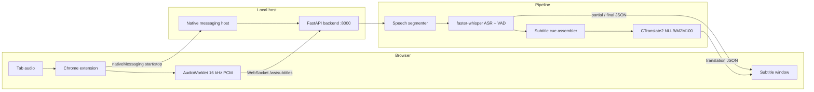

# Local Live Subtitle Translator

**Local-first multilingual subtitles and translations for browser video.**

The app captures browser audio, transcribes the selected spoken language with Whisper on your machine, translates it into the language you choose, and displays both in a dedicated subtitle window. Audio, inference, and transcript storage stay on localhost by default—nothing is sent to a cloud subtitle API during normal operation.

Built for people who want readable bilingual subtitles with low latency, without handing browser audio to a remote service.

## Badges

| | |
| --- | --- |
| Python | 3.11+ (3.12 tested) |
| Browser | Chrome / Chromium / Brave / Firefox |
| Platform | Linux (native messaging host); backend is portable Python |

No license file or CI workflow is present in this repository at the time of writing.

---

## Overview

Streaming video, news, lectures, and podcasts often lack subtitles in the language a viewer needs. This project closes that gap with a local real-time speech pipeline:

1. A browser extension captures **tab audio** (not microphone input).
2. PCM audio streams over a **local WebSocket** to a FastAPI backend.
3. The backend segments speech, runs language-directed ASR with [faster-whisper](https://github.com/SYSTRAN/faster-whisper) (`large-v3-turbo` by default), builds word-aware subtitle cues, and translates with **NLLB-200-distilled-600M** or **M2M100** through CTranslate2.
4. Source text and its translation return to the extension and render in a popup subtitle window.

The system is designed for **interactive latency**: partial source-language previews, bounded queues under load, final-over-partial ASR priority, and selectable **fast / balanced / quality** profiles that trade speed against accuracy.

Privacy is a first-class constraint. The backend binds to `127.0.0.1`, the extension only talks to localhost, transcript logging is off by default, and session history is stored in local SQLite files you control.

---

## Features

Verified capabilities in the current codebase:

- **Multilingual live ASR** with faster-whisper (`large-v3-turbo` default; `small` still supported)
- **Word-level timestamps and Silero VAD** on final ASR paths (configurable)
- **Selectable source and translation languages** via CTranslate2 NLLB or M2M100
- **Chrome tab audio capture** through `tabCapture` and an AudioWorklet resampler (→ 16 kHz PCM)
- **Dual-column subtitle window** — original text and translation with scrollable session history
- **Processing modes** — `fast`, `balanced`, `quality` (beam size and segmentation differ per mode)
- **CPU and NVIDIA CUDA** execution for ASR (CUDA selected in extension Advanced settings)
- **Per-session context hints** — optional topic/terminology prompt sent to ASR
- **Glossary** — local TSV rules applied before translation (`GLOSSARY_ENABLED=1`)
- **Practising Vocabulary** — click a source-language word to save it with sentence context (browser `localStorage`)
- **Automatic reconnect** with backoff when the WebSocket drops
- **Graceful stop** — flush final audio, finish pending translations, close streams cleanly
- **Session history** — SQLite persistence of sessions and subtitle rows (configurable)
- **Transcript export** — TXT, VTT, SRT from the extension settings panel
- **Local session snapshots** — save/restore transcript state in `localStorage`
- **Keyboard shortcuts** — start/stop, pause, mute monitor, export
- **Health, metrics, and debug endpoints** for readiness and pipeline inspection
- **Adaptive partial ASR** — suppresses overlapping partial inference under load
- **Bounded ASR/translation queues** with final-segment preservation under backpressure

---

## How It Works



### Components

| Component | Role |
| --- | --- |
| **`frontend-extension/`** | Manifest V3 extension: opens subtitle window, captures tab audio, streams PCM, renders subtitles, manages UI state |
| **`native-host/`** | Chrome Native Messaging host (`com.polatozgur111.dutch_subtitle_backend`) that starts, stops, and restarts the backend process |
| **`backend/app/`** | FastAPI service, WebSocket session handler, ASR, translation, metrics, history |
| **`backend/scripts/`** | Translation model preparation and offline pipeline benchmark |
| **`docs/`** | Performance baselines, cache evaluation, implementation notes |

### Runtime flow

1. User clicks the extension icon on a video tab → popup subtitle window opens (`subtitle.html?tabId=…&autostart=1`).
2. Extension asks the native host to launch `backend/run_gpu.sh` (uvicorn on port 8000).
3. Backend serves `/health/live` immediately; `/health/ready` returns 503 until Whisper and translation models finish loading.
4. Extension opens `ws://127.0.0.1:8000/ws/subtitles`, sends a `config` message (mode, context prompt, sample rate).
5. Audio chunks arrive as binary WebSocket frames; the segmenter detects speech boundaries and enqueues ASR jobs.
6. Partial source text may appear before a sentence is final; finalized sentences are translated and pushed as `final` events.
7. Optional SQLite history records sessions when `SESSION_HISTORY_ENABLED=1`.

---

## Tech Stack

| Layer | Technology |
| --- | --- |
| Browser UI | Vanilla HTML/CSS/JS (Manifest V3, no frontend framework) |
| Tab capture | Chrome `tabCapture`, `AudioWorklet`, WebSocket client |
| Backend API | FastAPI, uvicorn, WebSocket |
| ASR | [faster-whisper](https://github.com/SYSTRAN/faster-whisper) (CTranslate2-backed Whisper) |
| Translation | CTranslate2 converted M2M100 (`facebook/m2m100_418M`); Transformers fallback |
| Segmentation | NumPy audio buffer, silence/max-duration finalization, sentence assembly |
| Session storage | SQLite (`session-history.sqlite3`, optional durable translation cache) |
| Extension storage | `localStorage` (saved sessions, practising vocabulary) |
| Communication | WebSocket (audio + JSON events); Chrome Native Messaging (backend lifecycle) |
| Testing | pytest (backend), Node built-in test runner (extension), ruff, mypy |

---

## Requirements

### Required

| Requirement | Notes |
| --- | --- |
| **Linux** | Native messaging install/uninstall scripts target Linux config paths (`~/.config/google-chrome/…`, Chromium, Brave) |
| **Python 3.11+** | Use the project virtualenv (`make install-backend`) |
| **Chrome, Chromium, Brave, or Firefox** | Chromium uses tab capture; Firefox uses a system-audio monitor source |
| **Disk space** | Whisper model cache + converted M2M100 model (roughly 2–4 GB depending on ASR model size) |
| **Network (first setup)** | Initial download of Whisper weights and Hugging Face translation model during preparation |

### Optional

| Requirement | Notes |
| --- | --- |
| **NVIDIA GPU + CUDA** | Lower ASR latency; select **NVIDIA GPU** in extension Advanced settings |
| **Node.js 18+** | Running `npm test` / frontend syntax checks only—not needed at runtime |
| **honcho / foreman / overmind** | Running `make local-dev` via Procfile |

macOS and Windows are not documented or supported for the native messaging host in this repository.

---

## Quick Start

Minimal path to a working local setup on Linux:

```bash
git clone https://github.com/oplt/whisperdutch.git
cd whisperdutch

make install-backend
cp backend/.env.example backend/.env
make prepare-models
```

Load the extension and obtain its ID:

1. Open `chrome://extensions` (or `brave://extensions`).
2. Enable **Developer mode**.
3. Click **Load unpacked** and select `frontend-extension/`.
4. Copy the **Extension ID** shown on the card.

Register the native messaging host:

```bash
# Add to backend/.env (or export before install):
# DUTCH_SUBTITLE_EXTENSION_ID=<your-extension-id>

bash native-host/install_linux.sh
```

Use the application:

1. Open a page with audio/video in your browser.
2. Click the extension icon → the subtitle window opens.
3. Click **Start listening** if capture did not begin automatically.
4. Choose the spoken and translation languages under **Settings → General**.
5. The source transcription and translation appear in the subtitle window.

To run the backend manually (without the extension launcher):

```bash
cd backend
source .venv/bin/activate
./run_gpu.sh
```

---

## Installation

### Backend

```bash
make install-backend
```

This creates `backend/.venv` and installs runtime + dev dependencies from `backend/requirements-dev.txt` (which includes `requirements.txt`).

Copy and edit environment defaults:

```bash
cp backend/.env.example backend/.env
```

Start the API server:

```bash
cd backend && source .venv/bin/activate && ./run_gpu.sh
```

Or from the repository root:

```bash
make local-dev
```

The server listens on `127.0.0.1:8000` by default (`BACKEND_HOST`, `BACKEND_PORT`).

### Translation model

Prepare a CTranslate2 translation model (NLLB recommended; M2M100 still supported):

```bash
backend/scripts/prepare_translation_ct2.sh nllb
# or
backend/scripts/prepare_translation_ct2.sh m2m100
```

Or from the repository root:

```bash
make prepare-models
```

NLLB example configuration (defaults in `.env.example`):

```bash
TRANSLATION_ENGINE=auto
TRANSLATION_MODEL_FAMILY=nllb
TRANSLATION_MODEL=models/nllb-200-distilled-600m-ct2
TRANSLATION_TOKENIZER=facebook/nllb-200-distilled-600M
```

M2M100 backward-compatible configuration:

```bash
TRANSLATION_MODEL_FAMILY=m2m100
TRANSLATION_MODEL=models/m2m100-418m-ct2
TRANSLATION_TOKENIZER=facebook/m2m100_418M
```

**Licensing:** Meta NLLB checkpoints may impose non-commercial or research constraints. Review the model license on Hugging Face before commercial deployment.

If the CTranslate2 model is missing, startup fails with an actionable path to the preparation script.

### Chrome extension

1. Open `chrome://extensions`.
2. Enable **Developer mode**.
3. **Load unpacked** → select the `frontend-extension/` directory.
4. Pin the extension if desired.

The extension requests `activeTab`, `tabs`, `tabCapture`, and `nativeMessaging`. Host permissions are limited to `127.0.0.1` and `localhost`.

### Firefox extension

Build the Firefox package with `make build-firefox`, then load `dist/firefox/manifest.json` from `about:debugging`. Firefox audio capture uses a PipeWire/PulseAudio monitor source. See [Firefox installation](docs/firefox.md) for the full setup.

### Native messaging host

The native host exists because Chromium extensions cannot spawn arbitrary local processes directly. It exposes `start_backend`, `restart_backend`, and `stop_backend` commands over stdin/stdout framing.

Install (Linux):

```bash
bash native-host/install_linux.sh
```

The installer writes manifests to Chrome/Chromium/Brave and Firefox native-messaging directories. Chromium requires **`DUTCH_SUBTITLE_EXTENSION_ID`** in one of:

- environment variable
- `backend/.env`
- `EXTENSION_ID.txt` at the repository root

Optional: set `DUTCH_SUBTITLE_EXTENSION_PUBLIC_KEY` (or `EXTENSION_PUBLIC_KEY.txt`) to rewrite the manifest `key` field for a stable extension ID across machines.

Uninstall:

```bash
bash native-host/uninstall_linux.sh
```

**Important:** If you reload the unpacked extension and the ID changes, update `DUTCH_SUBTITLE_EXTENSION_ID` and re-run `install_linux.sh`.

---

## Configuration

Important options from `backend/.env.example`. See that file for the full list.

### ASR

| Variable | Default | Description |
| --- | ---: | --- |
| `ASR_DEVICE` | `cpu` | `cpu`, `cuda`, or `auto` |
| `ASR_MODEL` | `large-v3-turbo` | Whisper model (`small` for weak hardware) |
| `ASR_COMPUTE_TYPE` | auto | `int8` on CPU; `float16` on CUDA when empty |
| `ASR_VAD_FILTER` | `1` | Silero VAD inside faster-whisper for final paths |
| `FINAL_ASR_WORD_TIMESTAMPS` | `1` | Word timestamps on final/balanced/quality ASR |
| `PARTIAL_ASR_WORD_TIMESTAMPS` | `0` | Keep partial ASR text-only for latency |
| `ASR_LANGUAGE` | `nl` | Warmup/default language; session selection is sent over WebSocket |
| `FAST_ASR_BEAM_SIZE` | `1` | Beam width in **fast** mode |
| `BALANCED_ASR_BEAM_SIZE` | `2` | Beam width in **balanced** mode |
| `QUALITY_ASR_BEAM_SIZE` | `3` | Beam width in **quality** mode |
| `ASR_INITIAL_PROMPT` | *(empty)* | Optional default ASR context hint |
| `PARTIAL_ASR_ENABLED` | `1` | Enable interim source-language previews |
| `PARTIAL_ASR_INTERVAL_MS` | `900` | Minimum interval between partial ASR calls |

### Translation

| Variable | Default | Description |
| --- | ---: | --- |
| `TRANSLATION_ENGINE` | `auto` | `auto`, `ctranslate2`, or `transformers` |
| `TRANSLATION_MODEL_FAMILY` | `nllb` | `nllb`, `m2m100`, `marian`, or `auto` |
| `TRANSLATION_MODEL` | `models/nllb-200-distilled-600m-ct2` | CTranslate2 model directory |
| `TRANSLATION_TOKENIZER` | `facebook/nllb-200-distilled-600M` | Tokenizer name/path |
| `EXPORT_ALIGNMENT_ENGINE` | `live` | Set to `whisperx` for optional HQ export |
| `TRANSLATION_DEVICE` | `cpu` | Translation runtime device |
| `TRANSLATION_COMPUTE_TYPE` | `int8` | CTranslate2 compute type |
| `TRANSLATION_BEAM_SIZE` | `1` | Translation beam search width |
| `TRANSLATION_CACHE_ITEMS` | `4096` | In-memory LRU translation cache size |

### Segmentation and queues

| Variable | Default | Description |
| --- | ---: | --- |
| `FAST_MAX_SEGMENT_SECONDS` | `2.8` | Max utterance length before forced final (fast) |
| `BALANCED_MAX_SEGMENT_SECONDS` | `5.5` | Max utterance length (balanced) |
| `QUALITY_MAX_SEGMENT_SECONDS` | `6.5` | Max utterance length (quality) |
| `PIPELINE_QUEUE_MAX_SEGMENTS` | `3` | ASR queue capacity |
| `TRANSLATION_QUEUE_MAX_ITEMS` | `4` | Translation queue capacity |
| `PRE_ROLL_SECONDS` | `0.15` | Audio pre-roll prepended to segments |

### Storage and privacy

| Variable | Default | Description |
| --- | ---: | --- |
| `SESSION_HISTORY_ENABLED` | `1` | Persist sessions/subtitles to SQLite |
| `SESSION_HISTORY_DB` | `logs/session-history.sqlite3` | Session history database path |
| `LOG_TRANSCRIPT_TEXT` | `0` | Log subtitle text to backend log files |
| `GLOSSARY_ENABLED` | `0` | Apply `config/glossary.tsv` corrections |
| `LOCAL_MODELS_ONLY` | `1` | Avoid Hugging Face downloads at translation load time |

### Extension / native host

| Variable | Default | Description |
| --- | ---: | --- |
| `DUTCH_SUBTITLE_EXTENSION_ID` | *(empty)* | Required for native messaging install |
| `DUTCH_SUBTITLE_EXTENSION_PUBLIC_KEY` | *(empty)* | Optional manifest key for stable extension ID |

Per-session ASR context can also be set from the extension **Settings → Advanced → Context hint** without restarting the backend.

---

## Performance Profiles

Three client-selectable modes map to different ASR beam sizes and segmentation timings (see `FAST_*`, `BALANCED_*`, `QUALITY_*` variables).

| Mode | Intended use | Trade-off |
| --- | --- | --- |
| **Low latency (`fast`)** | Live viewing, conversational speech | Shorter segments, beam size 1, lowest delay |
| **Balanced** | Default everyday use | Middle ground between speed and accuracy |
| **High accuracy (`quality`)** | Difficult audio, formal speech | Longer segments, wider beam, higher latency |

### Recommended CPU profile

```bash
ASR_DEVICE=cpu
ASR_MODEL=small
ASR_COMPUTE_TYPE=int8
TRANSLATION_DEVICE=cpu
TRANSLATION_COMPUTE_TYPE=int8
```

Measured on CPU/int8 with Whisper `small` (see `docs/performance-baseline.md`): final ASR p50 ≈ 830 ms, translation p50 ≈ 27 ms, total subtitle latency p50 ≈ 1.3 s for real sessions. Figures vary with hardware and audio quality.

### Recommended CUDA profile

```bash
ASR_DEVICE=cuda
ASR_COMPUTE_TYPE=float16
TRANSLATION_DEVICE=cpu    # keeps GPU free for Whisper; translation is comparatively cheap
```

Select **NVIDIA GPU** in the extension Advanced settings to pass `asr_device=cuda` through the native host (`ASR_DEVICE_OVERRIDE`).

---

## Privacy and Local Processing

| Data | Default behavior |
| --- | --- |
| Tab audio | Captured in-browser, streamed to **localhost only** via WebSocket |
| Cloud APIs | No cloud ASR or translation service in the default pipeline |
| Model downloads | Whisper weights and M2M100 may download from Hugging Face / faster-whisper caches on first run |
| Backend logs | Daily rotating logs under `backend/logs/`; **transcript text excluded** unless `LOG_TRANSCRIPT_TEXT=1` |
| Session history | SQLite at `backend/logs/session-history.sqlite3` when enabled |
| Translation cache | In-memory LRU by default; optional durable SQLite cache (off unless configured) |
| Extension transcript | Held in memory; explicit **Save** writes to `localStorage` |
| Practising vocabulary | Stored in browser `localStorage` only |

The app is **local-first**, not strictly air-gapped: initial model setup and Hugging Face tokenizer loading may require network access unless models are pre-provisioned and `LOCAL_MODELS_ONLY=1` is satisfied.

Disable backend transcript persistence:

```bash
SESSION_HISTORY_ENABLED=0
LOG_TRANSCRIPT_TEXT=0
```

---

## Subtitle Export and History

### Export formats

From **Settings → Advanced → Transcript session**:

| Format | Description |
| --- | --- |
| **TXT** | Timestamped plain text (`[mm:ss.ms]` blocks) |
| **VTT** | WebVTT with cue timestamps |
| **SRT** | SubRip subtitles |

Keyboard shortcut: **`E`** exports TXT when the subtitle window is focused.

### History layers

| Layer | Location | Scope |
| --- | --- | --- |
| Live subtitle feed | Subtitle window | Current session, scrollable |
| Saved sessions | Extension `localStorage` | Manual save/restore in settings |
| Backend session history | SQLite | API at `/api/history` when enabled |

---

## API and Observability

HTTP base URL: `http://127.0.0.1:8000`

| Endpoint | Purpose |
| --- | --- |
| `GET /health/live` | Process is up (available before models finish loading) |
| `GET /health/ready` | Models loaded and warmed (`503` until ready) |
| `GET /debug/device` | ASR/translation device info, pipeline flags, startup phase |
| `GET /metrics` | Recent session metrics and translation cache stats |
| `GET /debug/sessions` | Active/recent WebSocket session summaries |
| `GET /debug/session/{client_id}` | Single session metrics |
| `GET /api/history` | Recent persisted sessions |
| `GET /api/history/{client_id}` | Full session with subtitle rows |
| `DELETE /api/history/{client_id}` | Remove a persisted session |
| `GET/PUT /api/glossary` | Read/write glossary rules |
| `GET/PUT /api/privacy` | Toggle transcript logging |
| `GET /api/logs/recent` | Tail backend log file |
| `POST /api/logs/client` | Extension diagnostic events |
| `POST /api/cache/translation/clear` | Clear translation cache |
| `WS /ws/subtitles` | Binary PCM in; JSON subtitle events out |

WebSocket JSON event types include `partial`, `final_pending`, `final`, `flushed`, `error`, and `config_error`. Connections are rejected with code `1013` until `/health/ready` would succeed.

---

## Project Structure

```text
whisperdutch/
├── backend/
│   ├── app/                 # FastAPI app, ASR, translation, WebSocket sessions
│   ├── scripts/             # Model prep, offline benchmark
│   ├── tests/               # pytest suite
│   ├── logs/                # Runtime logs, SQLite databases (created at run time)
│   ├── models/              # Converted CTranslate2 translation model
│   ├── run_gpu.sh           # Backend entrypoint
│   ├── requirements.txt     # Runtime Python dependencies
│   └── .env.example         # Configuration template
├── frontend-extension/
│   ├── app/                 # Subtitle UI modules (state, capture, WebSocket, vocabulary)
│   ├── audio/worklet.js     # PCM resampling worklet
│   ├── test/                # Node test suite
│   └── manifest.json
├── native-host/
│   ├── start_backend_host.py
│   ├── install_linux.sh
│   └── uninstall_linux.sh
├── docs/                    # Performance baselines and engineering notes
├── scripts/check.sh         # Full quality gate
├── Makefile
└── Procfile                 # `make local-dev` backend launcher
```

---

## Development

### Quality checks

Run the full gate (compile, pytest, extension syntax check, npm test, ruff, mypy):

```bash
make check
```

Individual steps:

```bash
# Backend tests
cd backend && source .venv/bin/activate
PYTEST_DISABLE_PLUGIN_AUTOLOAD=1 python -m pytest tests

# Frontend tests
npm test

# Lint / types
ruff check backend/app backend/tests native-host/start_backend_host.py
mypy backend/app native-host/start_backend_host.py
```

### Backend-only development

```bash
cd backend
source .venv/bin/activate
./run_gpu.sh
```

Startup status is written to `backend/logs/startup-status.json`. Tail logs at `backend/logs/backend-YYYY-MM-DD.log`.

---

## Testing

| Suite | Command | Covers |
| --- | --- | --- |
| Backend | `pytest backend/tests` | ASR config, audio segmentation, WebSocket queue priority, translation cache, API startup, metrics, history, native host helpers, concurrency |
| Extension | `npm test` | WebSocket client, state machine, backend client, audio worklet resampling, vocabulary store, settings |

No coverage percentage is published in this repository.

---

## Benchmarking

### Offline pipeline benchmark

Measure ASR + translation latency on a 16 kHz WAV file:

```bash
cd backend
source .venv/bin/activate
python scripts/benchmark_pipeline.py path/to/audio.wav --mode fast
python scripts/benchmark_pipeline.py path/to/audio.wav --mode balanced --json
```

Reports per-segment and summary **ASR latency**, **translation latency**, **total latency**, and **realtime factor** (p50/p95/max in summary).

### Documented baselines

| Document | Content |
| --- | --- |
| `docs/performance-baseline.md` | Pre-optimization measurements (CPU/int8, Whisper small) |
| `docs/performance-after.md` | Post-optimization comparison |
| `docs/backend-performance.md` | Segmenter, partial ASR, and ASR mode microbenchmarks |
| `docs/translation-cache-evaluation.md` | Cache hit ratios on real subtitle corpus |

### Frontend worklet benchmark

```bash
npm run benchmark:worklet
```

---

## Troubleshooting

| Problem | Likely cause / fix |
| --- | --- |
| **Native messaging host not found** | Run `bash native-host/install_linux.sh` with correct `DUTCH_SUBTITLE_EXTENSION_ID`; restart browser |
| **Extension ID mismatch** | Reloading unpacked extension may change ID — update `.env` and re-install native host |
| **Backend not ready / 503** | Models still loading — wait for `/health/ready`; check `backend/logs/` and `startup-status.json` |
| **CUDA unavailable** | Install CUDA-enabled CTranslate2; verify with `ctranslate2.get_cuda_device_count()`; or use CPU mode |
| **Translation model missing** | Run `make prepare-models`; confirm `backend/models/m2m100-418m-ct2/` exists |
| **Selected pair is unsupported** | Your existing `.env` may still select OPUS-MT; follow [multilingual model setup](docs/multilingual.md) and restart |
| **No tab audio / no subtitles** | Start capture from the **same tab** that plays audio; check browser tab-mute and capture permissions |
| **Subtitles lag behind speech** | Switch to **Low latency** mode; enable CUDA; reduce `ASR_MODEL`; check CPU load and queue drops in `/metrics` |
| **Whisper download fails** | Ensure network access for first model fetch; check Hugging Face / cache permissions |
| **WebSocket disconnects** | Extension auto-reconnects; if persistent, restart backend from Advanced settings |
| **Empty practising vocabulary meaning** | Click words after the translation arrives; partial-only lines have no sentence translation yet |

---

## Limitations

- **Language quality** — Accuracy and speed vary by language pair; smaller M2M100 and Whisper models favor responsiveness over maximum quality.
- **Browser integration** — Chromium captures tab audio directly; Firefox requires choosing a system-audio monitor source.
- **Native host** — Install scripts are Linux-specific; other platforms need manual Native Messaging setup.
- **Latency** — CPU-only ASR on long utterances can exceed real-time; GPU improves headroom substantially.
- **Accuracy** — Depends on tab audio quality, background noise, and proper tab selection (capture the tab that actually plays audio).
- **Word-level vocabulary meanings** — Practising Vocabulary stores the sentence translation as context, not a dictionary gloss per word.
- **No packaged releases** — Expect to load the extension unpacked and run the backend from source.

---

## Contributing

Contributions are welcome. Before opening a pull request:

1. Run `make check`.
2. Keep changes focused and covered by tests where behavior is non-obvious.
3. Update `backend/.env.example` if you add configuration surface.

---

## Further Reading

- [`PRODUCT.md`](PRODUCT.md) — product intent and UX principles
- [`docs/final-implementation-report.md`](docs/final-implementation-report.md) — architecture and optimization summary
- [`backend/.env.example`](backend/.env.example) — complete configuration reference
