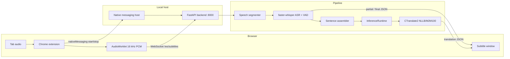

# Local Live Subtitle Translator

**Local-first multilingual subtitles and translations for browser video.**

The app captures browser audio, transcribes the selected spoken language with Whisper on your machine, translates it into the language you choose, and displays both in a dedicated subtitle window. Audio, inference, and transcript storage stay on localhost by default—nothing is sent to a cloud subtitle API during normal operation.

Built for people who want readable bilingual subtitles with low latency, without handing browser audio to a remote service.

## Badges

| | |
| --- | --- |
| Python | 3.11+ (3.12 tested) |
| Browser | Chrome / Chromium / Brave / Firefox |
| Platform | Linux (native messaging host); backend is portable Python |

No license file or CI workflow is present in this repository at the time of writing.

---

## Overview

Streaming video, news, lectures, and podcasts often lack subtitles in the language a viewer needs. This project closes that gap with a local real-time speech pipeline:

1. A browser extension captures **tab audio** (Chromium) or a **system-audio monitor** (Firefox).
2. PCM audio streams over a **local WebSocket** to a FastAPI backend, with **time-based backpressure** when the socket congests.
3. The backend segments speech, runs language-directed ASR with [faster-whisper](https://github.com/SYSTRAN/faster-whisper), builds sentence-aware subtitle cues, and translates with **NLLB-200-distilled-600M** (recommended) or **M2M100** through CTranslate2.
4. Source text and its translation return to the extension and render in a popup subtitle window.

The system is designed for **interactive latency**: partial source-language previews, bounded queues under load, final-over-partial ASR priority, cross-session translation batching, and selectable **fast / balanced / quality** profiles.

Privacy is a first-class constraint. The backend binds to `127.0.0.1`, the extension only talks to localhost, transcript logging is off by default, and session history is stored in local SQLite files you control.

---

## Features

Verified capabilities in the current codebase:

- **Multilingual live ASR** with faster-whisper (`large-v3-turbo` default; `small` for CPU/low latency)
- **20 UI languages** for source and target selection (Dutch, English, German, French, Spanish, Turkish, Arabic, Japanese, and others)
- **NLLB or M2M100 translation** via CTranslate2 with per-session language pairs over WebSocket `config`
- **Word-level timestamps and Silero VAD** on final ASR paths (configurable)
- **Chrome tab audio capture** through `tabCapture` and an AudioWorklet resampler (→ 16 kHz PCM)
- **Dual-column subtitle window** — original text and translation with scrollable session history
- **Processing modes** — `fast`, `balanced`, `quality` (beam size and segmentation differ per mode)
- **CPU and NVIDIA CUDA** execution for ASR (CUDA selected in extension Advanced settings)
- **Process-level inference scheduling** — separate ASR/translation executors, final-over-partial priority, session fairness
- **Translation LRU cache** with optional durable SQLite L2 tier
- **Background session-history writer** — batched SQLite writes off the subtitle hot path
- **WebSocket audio backpressure** — hysteresis, drop/recover, and `audio_gap` reset semantics
- **Per-session context hints** — optional topic/terminology prompt sent to ASR
- **Glossary** — local TSV rules applied before translation (`GLOSSARY_ENABLED=1`)
- **Practising Vocabulary** — click a source-language word to save it with sentence context (browser `localStorage`)
- **Automatic reconnect** with backoff when the WebSocket drops
- **Graceful stop** — flush final audio, finish pending translations, close streams cleanly
- **Session history** — SQLite persistence of sessions and subtitle rows (configurable)
- **Transcript export** — TXT, VTT, SRT from the extension settings panel
- **Health, metrics, and debug endpoints** including startup timing and lightweight `/metrics` polling

---

## How It Works



### Components

| Component | Role |
| --- | --- |
| **`frontend-extension/`** | Manifest V3 extension: subtitle window, tab/monitor capture, WebSocket client, backpressure, UI state |
| **`native-host/`** | Chrome Native Messaging host (`com.polatozgur111.dutch_subtitle_backend`) that starts, stops, and restarts the backend |
| **`backend/app/`** | FastAPI service, WebSocket sessions, ASR, translation, inference runtime, metrics, history |
| **`backend/scripts/`** | Model preparation, startup/pipeline/concurrency benchmarks |
| **`docs/`** | Performance baselines and benchmark artifacts |

### Runtime flow

1. User clicks the extension icon on a video tab → popup subtitle window opens (`subtitle.html?tabId=…&autostart=1`).
2. Extension asks the native host to launch `backend/run_gpu.sh` (uvicorn on port 8000).
3. Backend serves `/health/live` immediately; `/health/ready` returns 503 until Whisper and translation models finish loading.
4. Extension opens `ws://127.0.0.1:8000/ws/subtitles` and sends a `config` message (`source_lang`, `target_lang`, mode, context prompt, sample rate).
5. Audio chunks arrive as binary WebSocket frames; the segmenter detects speech boundaries and enqueues ASR jobs through `InferenceRuntime`.
6. Partial source text may appear before a sentence is final; finalized sentences are translated and pushed as `final` events.
7. Optional SQLite history records sessions when `SESSION_HISTORY_ENABLED=1`.

---

## Tech Stack

| Layer | Technology |
| --- | --- |
| Browser UI | Vanilla HTML/CSS/JS (Manifest V3, no frontend framework) |
| Tab capture | Chrome `tabCapture`, `AudioWorklet`, WebSocket client |
| Backend API | FastAPI, uvicorn, WebSocket |
| ASR | [faster-whisper](https://github.com/SYSTRAN/faster-whisper) (CTranslate2-backed Whisper) |
| Translation | CTranslate2 **NLLB-200-distilled-600M** (default) or M2M100; Transformers fallback |
| Scheduling | `InferenceRuntime` — bounded queues, thread pools, cross-session translation batching |
| Segmentation | NumPy audio buffer, silence/max-duration finalization, sentence assembly |
| Session storage | SQLite (session history, optional durable translation cache) |
| Extension storage | `localStorage` (saved sessions, practising vocabulary) |
| Communication | WebSocket (audio + JSON events); Chrome Native Messaging (backend lifecycle) |
| Testing | pytest (backend, 156 tests), Node built-in test runner (extension, 68 tests), ruff, mypy |

---

## Requirements

### Required

| Requirement | Notes |
| --- | --- |
| **Linux** | Native messaging install/uninstall scripts target Linux config paths |
| **Python 3.11+** | Use the project virtualenv (`make install-backend`) |
| **Chrome, Chromium, Brave, or Firefox** | Chromium uses tab capture; Firefox uses a system-audio monitor source |
| **Disk space** | Whisper cache + NLLB CT2 model (~1–2 GB download, ~0.6–1.2 GB on disk after conversion) |
| **Network (first setup)** | Initial download of Whisper weights and Hugging Face translation model during preparation |

### Optional

| Requirement | Notes |
| --- | --- |
| **NVIDIA GPU + CUDA** | Lower ASR latency; select **NVIDIA GPU** in extension Advanced settings |
| **Node.js 18+** | Running `npm test` / frontend syntax checks only—not needed at runtime |
| **honcho / foreman / overmind** | Running `make local-dev` via Procfile |

macOS and Windows are not documented or supported for the native messaging host in this repository.

---

## Quick Start

Minimal path to a working local setup on Linux:

```bash
git clone https://github.com/oplt/whisperdutch.git
cd whisperdutch

make install-backend
cp backend/.env.example backend/.env

# NLLB is the recommended multilingual translation model (.env.example defaults)
cd backend && source .venv/bin/activate && bash scripts/prepare_translation_ct2.sh nllb
```

Load the extension and obtain its ID:

1. Open `chrome://extensions` (or `brave://extensions`).
2. Enable **Developer mode**.
3. Click **Load unpacked** and select `frontend-extension/`.
4. Copy the **Extension ID** shown on the card.

Register the native messaging host:

```bash
# Add to backend/.env:
# DUTCH_SUBTITLE_EXTENSION_ID=<your-extension-id>

bash native-host/install_linux.sh
```

Use the application:

1. Open a page with audio/video in your browser.
2. Click the extension icon → the subtitle window opens.
3. Click **Start listening** if capture did not begin automatically.
4. Open **Settings → General** and choose **Spoken language** and **Translate into** (e.g. Dutch → German).
5. Source transcription and translation appear in the subtitle window.

**After changing `backend/.env`**, restart the backend (Settings → **Restart backend** in the extension, or stop/start the native host). Translation models load once at startup—a stale process keeps the old model even if `.env` was updated.

To verify the active translation model:

```bash
curl -s http://127.0.0.1:8000/debug/device | python3 -m json.tool | grep translation_model
```

You should see `models/nllb-200-distilled-600m-ct2`, not an old `opus-mt-nl-en` path.

To run the backend manually:

```bash
cd backend
source .venv/bin/activate
./run_gpu.sh
```

---

## Installation

### Backend

```bash
make install-backend
cp backend/.env.example backend/.env
cd backend && source .venv/bin/activate && ./run_gpu.sh
```

Or from the repository root: `make local-dev`

The server listens on `127.0.0.1:8000` by default (`BACKEND_HOST`, `BACKEND_PORT`).

### Translation model

Prepare a CTranslate2 translation model (**NLLB recommended** for multilingual pairs):

```bash
backend/scripts/prepare_translation_ct2.sh nllb
# or for backward-compatible M2M100:
backend/scripts/prepare_translation_ct2.sh m2m100
```

`make prepare-models` runs the preparation script with its default family (`m2m100`); prefer the explicit `nllb` command above when using `.env.example` defaults.

NLLB configuration (defaults in `backend/.env.example`):

```bash
TRANSLATION_ENGINE=auto
TRANSLATION_MODEL_FAMILY=nllb
TRANSLATION_MODEL=models/nllb-200-distilled-600m-ct2
TRANSLATION_TOKENIZER=facebook/nllb-200-distilled-600M
TRANSFORMERS_TRANSLATION_MODEL=facebook/nllb-200-distilled-600M
```

M2M100 alternative:

```bash
TRANSLATION_MODEL_FAMILY=m2m100
TRANSLATION_MODEL=models/m2m100-418m-ct2
TRANSLATION_TOKENIZER=facebook/m2m100_418M
```

**Licensing:** Meta NLLB checkpoints may impose non-commercial or research constraints. Review the model license on Hugging Face before commercial deployment.

If the CTranslate2 model directory is missing, startup fails with an actionable path to the preparation script.

### Chrome extension

1. Open `chrome://extensions` → enable **Developer mode** → **Load unpacked** → `frontend-extension/`.

The extension requests `activeTab`, `tabs`, `tabCapture`, and `nativeMessaging`. Host permissions are limited to `127.0.0.1` and `localhost`.

### Firefox extension

Build with `make build-firefox`, then load `dist/firefox/manifest.json` from `about:debugging`. Firefox capture uses a PipeWire/PulseAudio monitor source—choose your system/tab monitor in the permission dialog when starting.

### Native messaging host

Install (Linux):

```bash
bash native-host/install_linux.sh
```

Requires **`DUTCH_SUBTITLE_EXTENSION_ID`** in `backend/.env`, the environment, or `EXTENSION_ID.txt`.

Uninstall: `bash native-host/uninstall_linux.sh`

If you reload the unpacked extension and the ID changes, update `DUTCH_SUBTITLE_EXTENSION_ID` and re-run `install_linux.sh`.

---

## Configuration

Important options from `backend/.env.example`. See that file for the full list.

### ASR

| Variable | Default | Description |
| --- | ---: | --- |
| `ASR_DEVICE` | `auto` | `cpu`, `cuda`, or `auto` |
| `ASR_MODEL` | `large-v3-turbo` | Whisper model (`small` for weak hardware / lower latency) |
| `ASR_COMPUTE_TYPE` | *(empty)* | `int8` on CPU; `float16` on CUDA when empty |
| `ASR_VAD_FILTER` | `1` | Silero VAD inside faster-whisper for final paths |
| `PARTIAL_ASR_ENABLED` | `1` | Interim source-language previews (translation on final only) |
| `PARTIAL_ASR_INTERVAL_MS` | `900` | Minimum interval between partial ASR calls |

### Translation

| Variable | Default | Description |
| --- | ---: | --- |
| `TRANSLATION_ENGINE` | `auto` | `auto`, `ctranslate2`, or `transformers` |
| `TRANSLATION_MODEL_FAMILY` | `nllb` | `nllb`, `m2m100`, `marian`, or `auto` |
| `TRANSLATION_MODEL` | `models/nllb-200-distilled-600m-ct2` | CTranslate2 model directory |
| `TRANSLATION_TOKENIZER` | `facebook/nllb-200-distilled-600M` | Tokenizer name/path |
| `TRANSLATION_CACHE_BACKEND` | `memory` | `memory` or `sqlite` for durable L2 cache |
| `LOCAL_MODELS_ONLY` | `1` | Avoid Hugging Face downloads at load time when models are local |

The extension sends `source_lang` and `target_lang` on each WebSocket session. When the backend reports `multilingual: true` (NLLB/M2M100), Settings shows all supported target languages. Marian/OPUS-MT models only support their fixed pair (typically Dutch→English).

### Inference and queues

| Variable | Default | Description |
| --- | ---: | --- |
| `INFERENCE_ASR_MAX_CONCURRENT` | `1` | Parallel ASR jobs (keep at 1 on CPU) |
| `INFERENCE_TRANSLATION_MAX_CONCURRENT` | `1` | Parallel translation batches |
| `INFERENCE_ASR_MAX_PENDING` | `16` | Global ASR queue cap (partials rejected when full) |
| `TRANSLATION_BATCH_COLLECT_MS` | `2` | Cross-session translation batch coalesce window |
| `PIPELINE_QUEUE_MAX_SEGMENTS` | `3` | Per-session ASR segment queue |
| `TRANSLATION_QUEUE_MAX_ITEMS` | `4` | Per-session translation queue |

### Storage, history, and startup

| Variable | Default | Description |
| --- | ---: | --- |
| `SESSION_HISTORY_ENABLED` | `1` | Persist sessions/subtitles to SQLite |
| `SESSION_HISTORY_QUEUE_MAX` | `1024` | Bounded background writer queue |
| `LOG_TRANSCRIPT_TEXT` | `0` | Log subtitle text to backend log files |
| `STARTUP_WARMUP_STRATEGY` | `sequential` | Model warmup order (`parallel` is opt-in/benchmark only) |

Per-session ASR context: **Settings → Advanced → Context hint**.

---

## Performance Profiles

| Mode | Intended use | Trade-off |
| --- | --- | --- |
| **Low latency (`fast`)** | Live viewing | Shorter segments, beam size 1, lowest delay |
| **Balanced** | Default everyday use | Middle ground |
| **High accuracy (`quality`)** | Difficult audio | Longer segments, wider beam |

### Recommended CPU profile

```bash
ASR_DEVICE=cpu
ASR_MODEL=small
ASR_COMPUTE_TYPE=int8
TRANSLATION_DEVICE=cpu
TRANSLATION_COMPUTE_TYPE=int8
```

See [`docs/performance-next-baseline.md`](docs/performance-next-baseline.md) for measured CPU/int8 figures (Whisper `small`, NLLB-600m).

### Recommended CUDA profile

```bash
ASR_DEVICE=cuda
ASR_COMPUTE_TYPE=float16
TRANSLATION_DEVICE=cpu
```

Select **NVIDIA GPU** in extension Advanced settings (`ASR_DEVICE_OVERRIDE` through the native host).

---

## Privacy and Local Processing

| Data | Default behavior |
| --- | --- |
| Tab audio | Streamed to **localhost only** via WebSocket |
| Cloud APIs | No cloud ASR or translation in the default pipeline |
| Model downloads | Whisper + NLLB/M2M100 may download on first setup |
| Backend logs | Daily logs under `backend/logs/`; transcript text **excluded** unless `LOG_TRANSCRIPT_TEXT=1` |
| Session history | SQLite at `backend/logs/session-history.sqlite3` when enabled |
| Extension transcript | In memory; explicit **Save** writes to `localStorage` |

Disable backend transcript persistence:

```bash
SESSION_HISTORY_ENABLED=0
LOG_TRANSCRIPT_TEXT=0
```

---

## Subtitle Export and History

| Format | Description |
| --- | --- |
| **TXT** | Timestamped plain text |
| **VTT** | WebVTT with cue timestamps |
| **SRT** | SubRip subtitles |

Export from **Settings → Advanced → Transcript session**, or press **`E`** in the subtitle window.

---

## API and Observability

HTTP base URL: `http://127.0.0.1:8000`

| Endpoint | Purpose |
| --- | --- |
| `GET /health/live` | Process is up (before models finish loading); includes startup timing |
| `GET /health/ready` | Models loaded and warmed (`503` until ready) |
| `GET /api/languages` | UI language catalog and translation capabilities when ready |
| `GET /debug/device` | ASR/translation model info, pipeline flags, startup phase |
| `GET /metrics` | Lightweight session summaries, cache stats, `timing_ms` self-timing |
| `GET /debug/sessions` | Full session metrics including latency samples |
| `GET /api/history` | Recent persisted sessions |
| `WS /ws/subtitles` | Binary PCM in; JSON subtitle events out |

WebSocket events: `partial`, `final_pending`, `final`, `flushed`, `error`, `config_error`, `audio_gap_ack`. Connections are rejected with code `1013` until models are ready.

Startup milestones are also written to `backend/logs/startup-status.json` (`live_ms`, `model_ready_ms`, per-phase warmup).

---

## Project Structure

```text
whisperdutch/
├── backend/
│   ├── app/                 # FastAPI, ASR, translation, inference runtime, WebSocket
│   ├── scripts/             # Model prep, benchmark_phase1, benchmark_startup, …
│   ├── tests/               # pytest suite
│   ├── models/              # Converted CTranslate2 translation models
│   ├── run_gpu.sh           # Backend entrypoint
│   └── .env.example         # Configuration template
├── frontend-extension/
│   ├── app/                 # UI, capture, WebSocket, backpressure, languages
│   ├── audio/worklet.js     # PCM resampling worklet
│   └── test/                # Node test suite
├── native-host/             # Native messaging launcher
├── docs/                    # Performance baseline + benchmark artifacts
├── scripts/check.sh         # Full quality gate (make check)
└── Makefile
```

---

## Development

### Quality checks

```bash
make check
```

Runs: `compileall`, pytest (156 tests), extension syntax check, `npm test` (68 tests), ruff, mypy.

Individual steps:

```bash
cd backend && source .venv/bin/activate
PYTEST_DISABLE_PLUGIN_AUTOLOAD=1 python -m pytest tests
npm test
ruff check backend/app backend/tests native-host/start_backend_host.py
mypy backend/app native-host/start_backend_host.py
```

Startup status: `backend/logs/startup-status.json`  
Logs: `backend/logs/backend-YYYY-MM-DD.log`

---

## Benchmarking

Reproducible harnesses (see [`docs/performance-next-baseline.md`](docs/performance-next-baseline.md)):

```bash
cd backend && source .venv/bin/activate
set -a && [ -f .env ] && . ./.env && set +a

# Full Phase 1 orchestrator
python scripts/benchmark_phase1.py --max-segments 4

# Individual harnesses
python scripts/benchmark_startup.py --compare-warmup --output /tmp/startup.json
python scripts/benchmark_pipeline.py /path/to/16k.wav --mode fast --json
python scripts/benchmark_concurrency.py --engine fake --sessions 1 2 4
```

Frontend worklet benchmark:

```bash
npm run benchmark:worklet
```

Artifacts are stored under `docs/benchmark-artifacts/`.

---

## Troubleshooting

| Problem | Likely cause / fix |
| --- | --- |
| **Translations always English** | Backend still running an old model (e.g. `opus-mt-nl-en`). Restart backend after editing `.env`. Verify `/debug/device` shows `nllb` and `multilingual: true`. Choose target language in **Settings → Translate into**. |
| **Target language list only shows English** | Backend loaded a Marian/OPUS model, not NLLB. Run `prepare_translation_ct2.sh nllb`, update `.env`, restart. |
| **Native messaging host not found** | Run `install_linux.sh` with correct `DUTCH_SUBTITLE_EXTENSION_ID`; restart browser |
| **Backend not ready / 503** | Models loading—wait for `/health/ready`; check `startup-status.json` and logs |
| **Translation model missing** | Run `bash scripts/prepare_translation_ct2.sh nllb`; confirm `backend/models/nllb-200-distilled-600m-ct2/` exists |
| **No tab audio / no subtitles** | Start capture from the tab that plays audio; check mute and permissions |
| **Subtitles lag** | Use **Low latency** mode; try CUDA; use `ASR_MODEL=small`; check `/metrics` queue depths |
| **Partial lines have no translation** | Expected—translation appears on **final** subtitles after a phrase completes |
| **WebSocket disconnects** | Extension auto-reconnects; restart backend if persistent |

---

## Limitations

- **Language quality** varies by pair; smaller Whisper and NLLB-600m models favor speed over maximum quality.
- **Browser integration** — Chromium tab capture vs Firefox system monitor.
- **Native host** — Linux install scripts only.
- **Latency** — CPU-only ASR on long utterances can exceed real-time; GPU helps substantially.
- **No packaged releases** — Load unpacked extension and run backend from source.

---

## Contributing

1. Run `make check`.
2. Keep changes focused; add tests for non-obvious behavior.
3. Update `backend/.env.example` when adding configuration.

---

## Further Reading

- [`PRODUCT.md`](PRODUCT.md) — product intent and UX principles
- [`docs/performance-next-baseline.md`](docs/performance-next-baseline.md) — reproducible performance baseline and benchmark commands
- [`backend/.env.example`](backend/.env.example) — complete configuration reference
